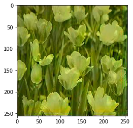
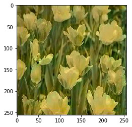
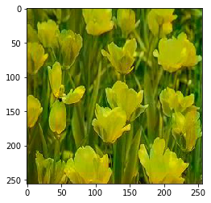
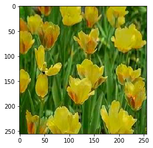

```python

```

    10-good-model.jpg
    MSE: 7809.26 , SSIM: 0.64





    20-good-model.jpg
    MSE: 7311.12 , SSIM: 0.66





    70-good-model.jpg
    MSE: 6252.78 , SSIM: 0.66





    300-good-model.jpg
    MSE: 4917.17 , SSIM: 0.74





    600-good-model.jpg
    MSE: 4810.86 , SSIM: 0.77


